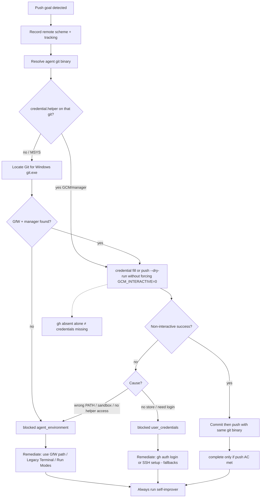

# Plan flow — Option A push preflight

```mermaid
flowchart TD
  start[Push goal detected] --> remote[Record remote scheme + tracking]
  remote --> agentGit[Resolve agent git binary]
  agentGit --> helper{credential.helper on that git?}
  helper -->|no / MSYS| tryGfw[Locate Git for Windows git.exe]
  helper -->|yes GCM/manager| probe[credential fill or push --dry-run without forcing GCM_INTERACTIVE=0]
  tryGfw --> gfwOk{GfW + manager found?}
  gfwOk -->|yes| probe
  gfwOk -->|no| envBlock[blocked agent_environment]
  probe --> ok{Non-interactive success?}
  ok -->|yes| proceed[Commit then push with same git binary]
  ok -->|no| classify{Cause?}
  classify -->|wrong PATH / sandbox / no helper access| envBlock
  classify -->|no store / need login| credBlock[blocked user_credentials]
  envBlock --> remediateEnv[Remediate: use GfW path / Legacy Terminal / Run Modes]
  credBlock --> remediateCred[Remediate: gh auth login or SSH setup - fallbacks]
  remediateEnv --> selfImp[Always run self-improver]
  remediateCred --> selfImp
  proceed --> done[complete only if push AC met]
  done --> selfImp
  noteGh[gh absent alone ≠ credentials missing]
  probe -.-> noteGh
```
