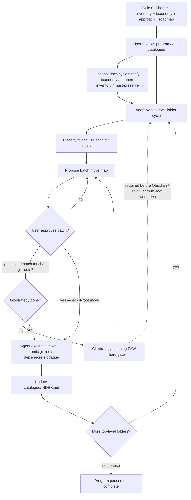
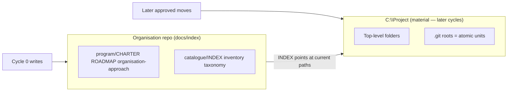

# Plan diagram — Cycle 0 and adaptive program

Session: `sessions/2026.09.09-0929/03-plan/`  
Companion to `plan.md`.

## Program flow (Cycle 0 → later)

```mermaid
flowchart TD
  C0[Cycle 0: Charter + inventory + taxonomy + approach + roadmap]
  Review[User reviews program/ and catalogue/]
  C1[Optional docs cycles: ratify taxonomy / deepen inventory / must-preserve]
  GitStrat[Git-strategy planning FAW — hard gate]
  Slice[Adaptive top-level-folder cycle]
  Classify[Classify folder + re-scan git roots]
  Propose[Propose batch move map]
  Approve{User approves batch?}
  Execute[Agent executes move — atomic git roots; deps/secrets opaque]
  Index[Update catalogue/INDEX.md]
  Next{More top-level folders?}

  C0 --> Review --> C1
  C1 --> Slice
  Review --> Slice
  Slice --> Classify --> Propose --> Approve
  Approve -->|no| Propose
  Approve -->|yes — and batch touches git roots?| GitCheck{Git-strategy done?}
  GitCheck -->|no| GitStrat --> Propose
  GitCheck -->|yes| Execute --> Index --> Next
  Approve -->|yes — no git-root move| Execute
  Next -->|yes| Slice
  Next -->|no / pause| Done[Program paused or complete]
  GitStrat -.->|required before Obsidian / ProjetOrif multi-root / worktrees| Slice
```

## Artefact homes

```mermaid
flowchart LR
  subgraph OrgRepo["Organisation repo (docs/index)"]
    P[program/CHARTER ROADMAP organisation-approach]
    C[catalogue/INDEX inventory taxonomy]
  end
  subgraph Corpus["C:\\Project (material — later cycles)"]
    T[Top-level folders]
    G[.git roots = atomic units]
  end
  C0docs[Cycle 0 writes] --> OrgRepo
  Later[Later approved moves] --> Corpus
  OrgRepo -->|INDEX points at current paths| Corpus
```
